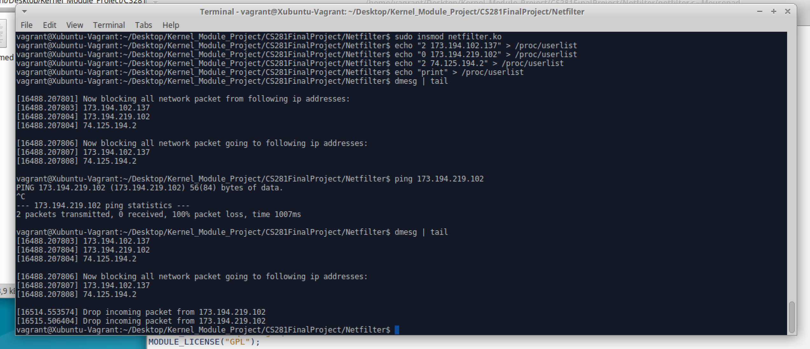

# Netfilter Kernel Module

## Introduction
This is a Linux Netfilter Kernel Module developed by Ziqi Yang (https://github.com/kenyangzq) and Xuanyang Ge (https://github.com/xuanyangge). It uses a /proc file named **userlist** to keep track of what network traffic to block. 
The module is maded and compiled in Linux v4.4.0-47.

We are inspired by examples in http://tuxthink.blogspot.com/2013/10/creating-read-write-proc-entry-in.html and http://www.paulkiddie.com/2009/11/creating-a-netfilter-kernel-module-which-filters-udp-packets/

## Compile and Insert

To run the module, download the Netfilter folder and use 

`make`

command in **/CS281FinalProject/Netfilter** directory to compile the code. Then open a terminal in Netfilter folder, and use

`sudo insmod netfilter.ko`

command to insert the kernel module. After inserting the module, run 

`dmesg` or `dmesg | tail` 

command should show that netfilter module has been loaded and the proc entry has been created. 

To remove the module, simply use

`sudo rmmod netfilter`

command in terminal.

## Input Format and Functionality

User should specify blocking incomming or outgoing or both direction and the ip address to block in the /proc/userlist file. User should input one ip address at a time, using format 

`echo "k xxx.xxx.xxx.xxx" > /proc/userlist`

The 1 bit integer k indicate the blocking direction. 0 means incoming, 1 means outgoing and 2 means both directions. The rest part is the ip address, which is separated from k by a single space. For example, to block incoming network packet from address 173.194.219.102, use 

`echo "0 173.194.219.102" > /proc/userlist`

command. And to block both direction network packet from address 8.8.8.8, use

`echo "2 8.8.8.8" > /proc/userlist`

command. We also implement the functionality to clear all the current list and to print out the current list of target ip address. Simply use 

`echo "r" > /proc/userlist`

command in the terminal to clear the list and use

`echo "print" > /proc/userlist`

command in the terminal to print the list of ip address to dmesg. 

## Test and Output

To test the module, the simplest way is to ping the ip address in the terminal. 

When the module detect the network packet, it will extract the ip address and compare it to those user specified. If a packet is blocked and dropped, information will be printed to the dmesg. User can check at anytime using `dmesg` or `dmesg | tail` command.  

One sample output is below: 

